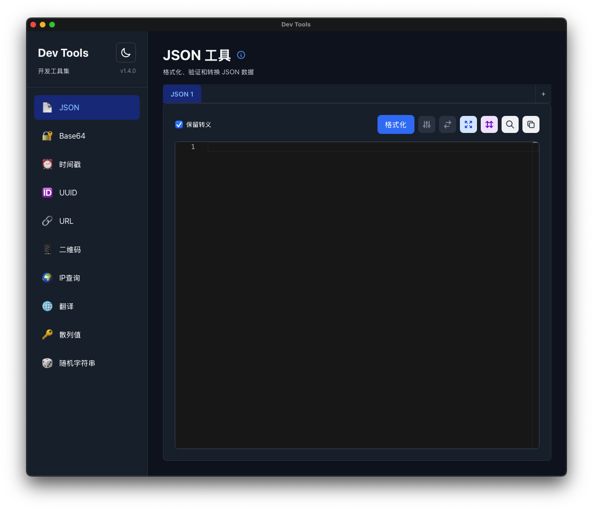

# Dev Tools

一个基于 Wails 开发的桌面开发工具集，提供常用的编码、转换和格式化工具。



## 功能特性

### 📄 JSON 工具
- JSON 格式化与压缩
- JSON 验证
- JSON 与 YAML 互转
- 保留转义字符选项
- 多标签页编辑（最多 20 个标签页）
- 标签页快捷键：
  - `Cmd/Ctrl+T` 新建标签页
  - `Cmd/Ctrl+W` 关闭当前标签页
  - `Ctrl+Tab` 切换到下一个标签页
  - `Ctrl+Shift+Tab` 切换到上一个标签页
- 支持标签页重命名和鼠标中键快速关闭
- 支持 JSON 语法高亮和搜索功能
- 支持全屏编辑模式

### 🔐 Base64 工具
- Base64 编码/解码
- URL 安全的 Base64 编码/解码
- Base64 格式验证
- 自动聚焦输入框

### ⏰ 时间戳工具
- 时间戳与时间字符串互转
- 支持秒级和毫秒级时间戳
- 当前时间格式化
- 获取当前时间戳
- 自动识别时间戳单位（秒/毫秒）
- 支持多种时间格式

### 🆔 UUID 工具
- 生成 UUID v1/v3/v4/v5
- 批量生成 UUID（最多 1000 个）
- 支持命名空间（v3/v5）
- 格式选项：
  - 大小写：小写（默认）或大写
  - 连字符：带连字符（默认）或无连字符
- 支持单个和批量复制

### 🔗 URL 工具
- URL 编码/解码
- 支持查询字符串编码
- 自动聚焦输入框

### 📱 二维码工具
- 生成二维码图片
- 支持多种尺寸（小、中、大）
- 下载二维码图片
- 自动聚焦输入框

### 🌍 IP查询工具
- 查询 IP 地址的地理位置信息
- 支持 IPv4 和 IPv6 地址
- 双数据源查询（ip-api.com 和 ipinfo.io）
- 显示国家、省份/州、城市等信息
- 自动聚焦输入框

### 🌐 翻译工具
- 支持中文、英文、韩文互译
- 基于有道智云 API
- 支持源语言和目标语言快速交换
- 首次使用需要配置 API 密钥

### 🔑 散列值计算工具
- 计算文本和文件的散列值
- 支持算法：MD5、SHA1、SHA256、SHA512
- 支持文本输入和文件选择两种方式
- 自动聚焦输入框（文本模式）

### 🎲 随机字符串工具
- 生成随机字符串
- 自定义长度（1-100）
- 常用长度快速选择（8、16、32、64、128）
- 字符类型选择（可多选）：
  - 数字（0-9）
  - 小写字母（a-z）
  - 大写字母（A-Z）
  - 特殊字符（!@#$%^&*...）
- 批量生成（1-100 个）
- 支持单个和批量复制
- 支持清空结果

## 快捷键

### 全局快捷键
- `Shift`（双击）：打开工具搜索框
- `↑/↓`：在搜索结果中导航
- `Enter`：选择工具
- `Esc`：关闭搜索框

### JSON 工具快捷键
- `Cmd/Ctrl+T`：新建标签页
- `Cmd/Ctrl+W`：关闭当前标签页
- `Ctrl+Tab`：切换到下一个标签页
- `Ctrl+Shift+Tab`：切换到上一个标签页

## Alfred 快速启动

通过 Alfred 可以快速打开指定的工具，提高工作效率。

### 使用方法

1. **命令行方式**：
   ```bash
   devtools <工具名>
   ```

2. **URL Scheme 方式**：
   ```
   devtools://tool/<工具名>
   ```

### 可用工具参数

- `json` - JSON 工具
- `base64` - Base64 工具
- `timestamp` 或 `ts` - 时间戳工具
- `uuid` - UUID 工具
- `url` - URL 工具
- `qrcode` - 二维码工具
- `ipquery` 或 `ip` - IP查询工具
- `translate` 或 `tr` - 翻译工具
- `hash` - 散列值计算工具
- `randomstring` - 随机字符串工具

### 示例

```bash
# 打开 JSON 工具
devtools json

# 打开时间戳工具
devtools ts

# 打开 IP 查询工具
devtools ip
```

## 技术栈

- **后端**：Go + Wails v2
- **前端**：React + Tailwind CSS
- **架构**：DDD（领域驱动设计）
- **编辑器**：Monaco Editor（JSON 工具）

## 开发

### 环境要求

- Go 1.21+
- Node.js 18+
- Wails CLI

### 安装依赖

```bash
# 安装前端依赖
cd frontend && npm install

# 安装 Wails（如果未安装）
go install github.com/wailsapp/wails/v2/cmd/wails@latest
```

### 运行开发环境

```bash
wails dev
```

### 构建应用

```bash
# 构建应用
wails build

# 构建并压缩
wails build -compress
```

## 版本

当前版本：1.4.0

## 许可证

Copyright © cyrnicolase
